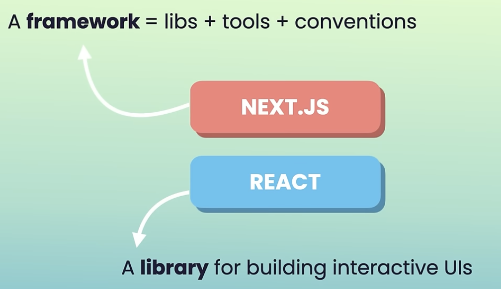

# what is nextjs
## an incredibly powerful ƒramework for building fast and search engine friendly apps
- built on top of react
- a framework is a collection of libraries, tools and conventions that streamline the development process.
- next has an in built router so we dont need react router

# ⭐️ Nextjs comes with:
## 1. a compiler to transform and minify js code
## 2. a cli to build and start apps
## 3. a node.js runtime:
- this allows us to do full stack dev and we can write both the frontend and backend code within the same next js project.
- the backend code gets run in the node.js runtime and the frontend code gets compiled, bundeled and sent to the client browser
- this is in contrast to react where you need a separate backend proj.
- this next js arch. also allows us to render our components on the server and send their contents to the clients (in the form of final minified bundles), this is called Server-side rendering and it makes our application faster and more seo friendly.
- with next we can prerender certain pages or components which have static data, and sever them wherever and whenever needed, this is called Static Site Generation and it makes a website superfast.

# What is Linting?
Linting is the process of analyzing source code to flag programming errors, bugs, stylistic errors, and suspicious constructs. A "linter" like ESLint scans your code and provides feedback, allowing you to catch potential issues early in the development process.

# ESLint
ESLint is a popular tool used in Node.js projects (and JavaScript in general) for identifying and reporting on patterns found in your code. It helps ensure that your code adheres to certain style guidelines and best practices, promoting cleaner and more maintainable code.

# Create the project: npx create-next-app@latest
## Files and project structure:
- the `app` folder, also called app router, this is the container for our routing system, in nextjs the router is inbuilt in the form of the file system inside the app directiory, we can simply create files and folders to represent routes.
    - layout.tsx: a basic react component that returns:
        ```ts
        <html lang="en">
        <body
            className={`${geistSans.variable} ${geistMono.variable} antialiased`}
        >
            {children}
        </body>
        </html>
        ```
        - this represents the common layout for our pages
        - inside the body we see `{children}` which gets dynamically replaced with the page of the route that the user is currently on.
    - page.tsx: our home page
    

